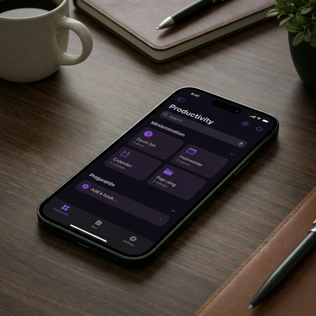
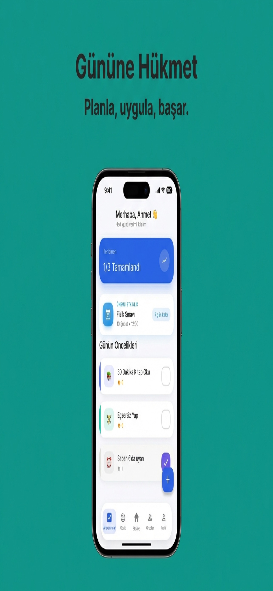
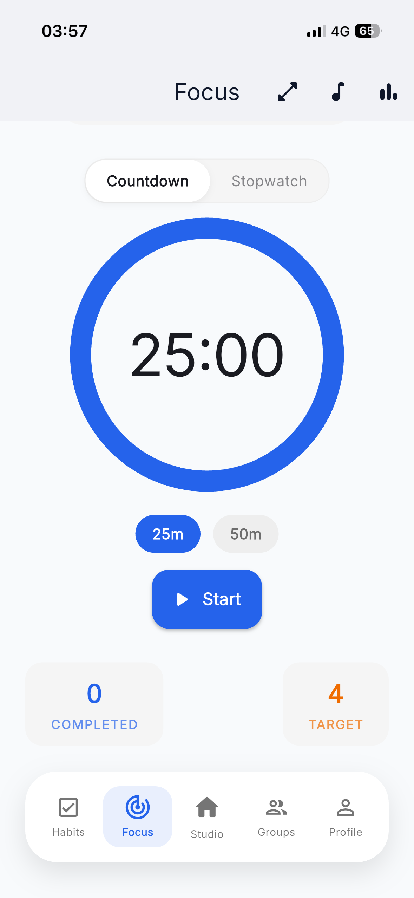

# Loofie - AI Study Coach



<p align="center">
  <a href="https://flutter.dev">
    
  </a>
  <a href="https://dart.dev">
    
  </a>
  <a href="#">
    
  </a>
</p>

> **"Discipline and motivation for modern students, all in one app."**

Loofie is a comprehensive productivity platform combining habit tracking, focus techniques (Pomodoro), and personalized guidance. Developed with a strong emphasis on User Experience (UX), it is designed to help students crush their academic goals.

---

## 📱 Key Capabilities

### 🎯 Focus & Productivity
Offers an optimized environment to minimize distractions:
*   **Customizable Timer:** Flexible counter adaptable to various work/break intervals.
*   **Deep Focus Mode:** Creates a study atmosphere with seamless ambient sounds running in the background.
*   **Live Study Rooms:** Real-time sessions that foster social motivation and accountability.

### 🧠 Personalized Mentorship (AI)
Beyond a standard chatbot, a system that analyzes user habits:
*   **Contextual Coaching:** Provides strategies tailored to the user's current state, not just generic advice.
*   **Motivation Support:** Professional guidance for stress management and procrastination.

### 📊 Data-Driven Growth
*   **Detailed Analytics:** Weekly reports and growth charts.
*   **Gamification:** Rewards consistency with badges and a leveling system.

---

## 📸 Interface Design

Adopts a user-friendly, modern, and distraction-free design language (Material 3).

| **Dashboard** | **Focus Mode** | **Mentor** |
|:---:|:---:|:---:|
|  |  |  |

---

## 🛠 Engineering Approach

This project is not just app development, but an exercise in building a **sustainable and scalable software architecture**.

### 🏗 Software Architecture (Clean Architecture)
Designed to be change-resilient and technology-agnostic.
*   **Separation of Concerns:** Business logic (Domain) is completely isolated from database or UI.
*   **Technology Agnostic:** Database or service providers used today can be swapped tomorrow without breaking the core application.
*   **Testability:** Each module can be tested independently.

### 🎨 User Experience (UX) Process
*   **Iterative Design:** Interface continuously improved based on user feedback.
*   **Performance Optimization:** Prioritized rendering performance for a "jank-free" experience.
*   **Accessibility:** Intuitive navigation designed for diverse user profiles.

### 🔧 Technical Competencies
*   **State Management:** Reactive and type-safe state management.
*   **Dependency Injection:** Modular and manageable dependency structure.
*   **Asynchronous Programming:** Optimized background processes and data streams.

---

## 📂 Project Structure

A high-level overview of the Clean Architecture implementation:

```
lib/
├── core/             # Shared utilities, extensions, and constants
├── data/             # Data sources, repositories implementation, and DTOs
├── domain/           # Entities, use cases, and repository interfaces
├── presentation/     # UI screens, widgets, and Riverpod providers
└── main.dart         # Application entry point
```

## 🛡️ Code Quality & DevOps

*   **CI/CD:** Automated build and analysis pipelines via GitHub Actions.
*   **Linting:** Strict Dart analysis rules applied for maintainable code.
*   **Error Handling:** Centralized failure handling with functional error programming concepts.

---

## 🚀 Download & Try

Loofie is actively developed and available on app stores.

<p align="center">
  <a href="YOUR_APP_STORE_LINK">
    
  </a>
  <a href="YOUR_PLAY_STORE_LINK">
    
  </a>
</p>

---

## 🔒 License

This project is **Closed Source**. Intellectual property rights are reserved.

**Copyright © 2024 Ahmet Atmaca.**

---

## 👋 Professional Contact

This project reflects my vision in mobile app development and product design. Feel free to contact me for technical details or collaboration.

[LinkedIn](YOUR_LINK) • [Email](YOUR_EMAIL)
